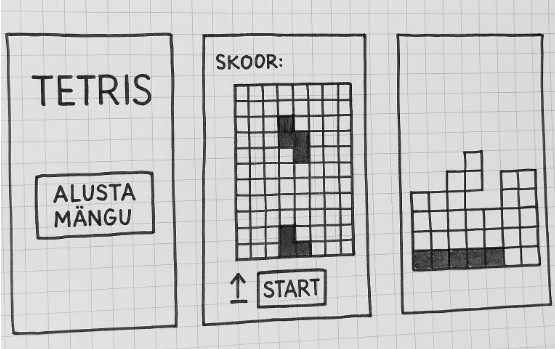

# tetris-projekt

**Aine:** Programmeerimise alused  
**Meeskond:** Anneli Sepp, Edgar Muoni  
**Grupp:** Targe24

## 1. Projekti nimi  
**Tetris – Klassikaline loogikamäng**

## 2. Rühma liikmed ja rollid

- **Anneli Sepp** – arendaja  
- **Edgar Muoni** – arendaja

## 3. Projekti idee – lühikirjeldus  
Loome klassikalise Tetrise mängu lihtsustatud versiooni, kus mängija juhib ülevalt alla kukkuvaid kujundeid (tetromino'sid), eesmärgiga täita horisontaalseid ridu ja koguda punkte.  
Mängu liides on loodud Tkinteri abil. Soovisime just klassikalist Tetrise versiooni, kuna üks meist tundis sellest isiklikult puudust.

## 4. Valitud projekti suund  
**Variant 4 – Kasutajaliides: Tkinter**

## 5. Kasutajalood ja prototüübi eskiisid

**Kasutajalugu 1 – Mängu alustamine**  
Kasutaja vajutab "Alusta mängu" nuppu ja mängulaud ilmub.

**Kasutajalugu 2 – Kujundi juhtimine**  
Kasutaja juhib ülevalt alla liikuvat kujundit klaviatuurinuppude abil: A – vasakule, D – paremale, W – pööramine, S – kiirem liikumine alla, tühik (Space) – kujundi kiire langetus.

**Kasutajalugu 3 – Rea täitumine ja eemaldamine**  
Kui rida täitub, kustutab süsteem selle automaatselt ja lisab kasutajale skoori.

**Prototüübi vaated**  
Lisatud visuaalsed eskiisid (vt pilt):  

- Avaleht "Alusta mängu" nupuga  
- Mängulaua vaade kukkuva kujundiga  
- Täitunud rea eemaldamise vaade

## 6. Testfaili nimi ja kirjeldus  
**Fail:** `test_tetris.py`  
Skript käivitab mängu või liidese demo. Näiteks:  
`python test_tetris.py`

## 7. GitHubi repositoorium  
**Link:** https://github.com/Annelisss/tetris-projekt.git

## 8. Halduskeskkond  
Projekti ülesannete haldamiseks kasutame **Trellot**  
**Trello tahvel:** [Tetris projekt Trellos](https://trello.com/invite/b/67fd7b84150ebc07898ed82c/ATTI885052c2fc9cee9744dac5b616944db30CCFE7A4/tetris-projekt)

## 9. Tööetapid ja vastutusjaotus

### 1. Projekti idee ja tehnoloogiate valik  
Mõlemad liikmed panustasid võrdselt projekti idee väljamõtlemisse. Otsustasime luua klassikalise Tetrise mängu, kasutades Tkinterit kasutajaliidese jaoks ja pygame'i taustamuusika mängimiseks.

### 2. GitHubi projekt ja versioonihaldus  
- Loodi ühine GitHubi repositoorium  
- Mõlemad liikmed lisasid oma testfailid (`test_anneli.py`, `test_edgar.py`)  
- README.md faili dokumentatsioon koostati koos

### 3. Koodiarendus ja programmeerimine

**Anneli vastutas:**
- Tkinteri kasutajaliidese struktuur (aken, lõuend, nupud, sildid)  
- Mängulaua ja "TETRIS" logo joonistamine  
- Kujundite liikumine ja pööramine  
- "TETRIS" ja "GAME OVER" teksti kuvamine

**Edgar vastutas:**
- Mängutsükli (`game_loop`) loomine  
- Klaviatuuri sündmuste töötlemine  
- Ridade kustutamine, skoori arvutamine ja taseme muutmine  
- pygame'i integreerimine ja muusika lisamine

### 4. Testimine ja veaparandus  
- Mõlemad testisid mängu käigus kõiki funktsioone  
- Tähelepanu pöörati eelkõige "GAME OVER" funktsionaalsusele ja taaskäivitamise loogikale

### 5. Dokumentatsioon ja korraldus  
- Projekti ülesanded ja tegevused hallati Trello kaudu  
- Dokumentatsioon (README) koostati koos

## Kokkuvõte  
Projekt valmis meeskonnatööna. Mõlemad liikmed panustasid aktiivselt ja järjepidevalt kõikidesse tööetappidesse. Tööjaotus võimaldas keskenduda olulistele arendusülesannetele ning tõstis lõpptulemuse kvaliteeti.
